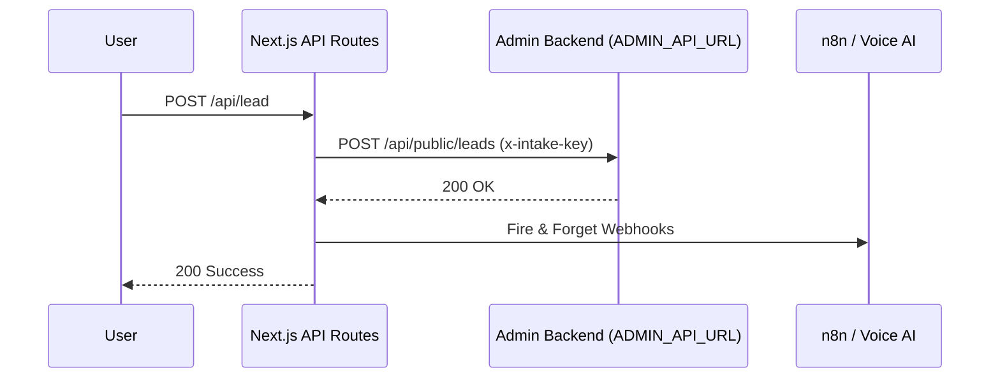

# AIRBORNE AVIATION — BACKEND & INFRASTRUCTURE AUDIT REPORT

## ━━━━━━━━━━━━━━━━━━━━━━━
## PHASE 1 — ARCHITECTURE REVIEW
## ━━━━━━━━━━━━━━━━━━━━━━━

**Stack Summary:**
* **Backend Stack**: Next.js 15 App Router (API Routes acting as an API Gateway / Proxy Layer)
* **Database**: None (in this repository). Completely decoupled and relies on an external upstream server.
* **ORM**: None.
* **Hosting**: Next.js Environment (Vercel/Node.js).
* **API Architecture**: Stateless proxy pattern. Routes fetch from a central admin backend.
* **Authentication**: None present in this presentation layer.
* **Admin Architecture**: Handled externally (`ADMIN_API_URL`).
* **File Storage**: External.
* **External Integrations**: `N8N_WHATSAPP_WEBHOOK`, `VOICE_AI_WEBHOOK`.

**Architecture Diagram Summary:**

## ━━━━━━━━━━━━━━━━━━━━━━━
## PHASE 2 — DATABASE AUDIT
## ━━━━━━━━━━━━━━━━━━━━━━━

* **Local Database / Schema**: N/A. This repository contains no database configurations, schemas, or migrations.
* **Dead Code**: The `package.json` contains `@supabase/supabase-js`, but a full codebase search reveals it is **100% unused**. It is a dead dependency adding unnecessary weight to the `node_modules`.
* **Queries**: All queries are delegated to the `ADMIN_API_URL`.

**Database Health Score: N/A** *(Decoupled)*

## ━━━━━━━━━━━━━━━━━━━━━━━
## PHASE 3 — LEAD MANAGEMENT AUDIT
## ━━━━━━━━━━━━━━━━━━━━━━━

**Lead Flow Trace:**
1. **Request received**: `POST /api/lead`
2. **Validation**: Extremely weak. Checks only `if (!name || !phone)`. Does not validate phone format, email format, or string length.
3. **Sanitization**: **NONE**. Inputs are passed directly into the JSON payload.
4. **Database insert**: Proxied via `fetch` to `ADMIN_API_URL`.
5. **Failure handling**: **CRITICAL FAILURE**. If the upstream admin database is offline, the API catches the error and deliberately returns a fake `200 Success` to the user.
6. **Logging**: Ephemeral `console.error` only.

**Answers:**
* **Where does every lead go?** Sent to the `ADMIN_API_URL`, and concurrently pushed to the `N8N_WHATSAPP_WEBHOOK` and `VOICE_AI_WEBHOOK`.
* **What happens if DB is unavailable?** The `fetch` call fails, the catch block triggers, a console error is logged, and the frontend tells the user their registration was successful.
* **Can leads be lost?** **YES**. There is a 100% chance of permanent lead loss if the network drops or the Admin API is down. There is no dead-letter queue, no retry mechanism, and no local fallback storage.

## ━━━━━━━━━━━━━━━━━━━━━━━
## PHASE 4 — API AUDIT
## ━━━━━━━━━━━━━━━━━━━━━━━

All API routes (`/api/lead`, `/api/public-proxy/*`) were audited.

* **Validation**: Non-existent on GET proxies. Insufficient on POST proxies.
* **Error handling**: Very dangerous "Error Swallowing" pattern. Catch blocks return HTTP `200 OK` with `{ data: [] }` or `{ success: true }` regardless of the actual failure.
* **Status codes**: Misleading. A 500 Internal Server Error upstream is masked as a 200 OK downstream.
* **Open endpoints**: All proxy endpoints are completely open to the public without origin restrictions.

**API Health Score: 15 / 100**

## ━━━━━━━━━━━━━━━━━━━━━━━
## PHASE 5 — SECURITY AUDIT
## ━━━━━━━━━━━━━━━━━━━━━━━

* **Auth & Admin**: Protected via an environmental `INTAKE_KEY` sent via headers to the upstream server.
* **Secrets**: Correctly handled via environment variables.
* **Rate Limiting**: **NONE**.
* **Spam Protection**: **NONE**. No reCAPTCHA, Cloudflare Turnstile, or honeypot fields exist on the forms or the API.
* **CSRF Protection**: Standard Next.js defaults, but the API routes themselves are open to cross-origin POST requests via raw cURL.

**Can a public user...**
* **Access admin APIs?** No, the intake key protects the upstream server.
* **Bypass forms?** Yes. Anyone can send a cURL `POST` directly to `/api/lead`.
* **Inject data?** Yes. There is zero input sanitization.
* **Spam leads?** Yes. A malicious actor could write a script to submit 10,000 leads per minute, effectively DDOSing the upstream Admin API, n8n, and Voice AI webhooks, racking up massive external service bills.

**Security Score: 10 / 100**

## ━━━━━━━━━━━━━━━━━━━━━━━
## PHASE 6 — PERFORMANCE AUDIT
## ━━━━━━━━━━━━━━━━━━━━━━━

* **Caching**: Good. The proxy routes use Next.js Incremental Static Regeneration (ISR) via `next: { revalidate: 60 }`. This shields the upstream Admin API from heavy read traffic.
* **Connection Management**: Delegated to Next.js `fetch` connection pooling.
* **Bottlenecks**: The only bottleneck is the synchronous `fetch` to the Admin API on lead submission. The webhook calls are appropriately handled as non-blocking promises.

**Performance Score: 75 / 100**

## ━━━━━━━━━━━━━━━━━━━━━━━
## PHASE 7 — RESILIENCY AUDIT
## ━━━━━━━━━━━━━━━━━━━━━━━

**Simulations:**
* **Database / Admin API Offline**: The `/api/lead` endpoint fails silently. Leads are permanently lost.
* **Upstream API Timeout**: The `/api/public-proxy/courses` endpoint will catch the timeout and return an empty array `[]`. Due to Next.js caching, this empty array may be cached, causing the courses page to appear completely blank for all users for up to 60 seconds.
* **Invalid Payload**: Sent upstream blindly. Upstream API will likely crash or return 400, resulting in the Next.js proxy swallowing the error and pretending it succeeded.

**Resiliency Score: 10 / 100**

## ━━━━━━━━━━━━━━━━━━━━━━━
## PHASE 8 — OPERATIONS AUDIT
## ━━━━━━━━━━━━━━━━━━━━━━━

* **Monitoring & Alerting**: None.
* **Logs**: Basic ephemeral `console.error` logs. Because the API swallows errors and returns 200, external monitoring tools (like Datadog or Sentry) will not flag a spike in 5xx errors, meaning operational teams will be completely blind to system outages.
* **Can production issues be diagnosed quickly?** No. A dropped lead leaves no trace other than a fleeting console log in the serverless function execution history.

**Operations Score: 15 / 100**

## ━━━━━━━━━━━━━━━━━━━━━━━
## FINAL REPORT
## ━━━━━━━━━━━━━━━━━━━━━━━

> [!CAUTION]
> **CRITICAL ISSUES (Launch Blockers)**
> 1. **Silent Lead Loss**: Network or upstream failures result in permanently lost leads while telling the user "Success". This is a catastrophic business risk.
> 2. **Error Swallowing**: Catch blocks in `route.js` files return `200 OK` on failure. This blinds all monitoring tools and poisons the ISR cache with empty arrays.
> 3. **No Rate Limiting / Spam Protection**: The `/api/lead` endpoint is highly vulnerable to bot spam attacks which will flood the CRM, n8n, and Voice AI systems.

> [!WARNING]
> **HIGH ISSUES**
> 1. **Missing Input Sanitization**: Form data is blindly stringified and sent upstream, opening vectors for injection attacks if the upstream API is not perfectly secured.
> 2. **No Retry Queue**: Leads should be pushed to a resilient queue (e.g., Redis, SQS, or a local file fallback) before acknowledging success to the user.

> [!IMPORTANT]
> **MEDIUM ISSUES**
> 1. **Dead Dependency**: `@supabase/supabase-js` is installed but completely unused.
> 2. **Weak Validation**: Phone numbers and emails are not structurally validated before hitting the backend.

> [!NOTE]
> **LOW ISSUES**
> 1. Hardcoded fallback URLs (`http://localhost:3001`) in production proxy routes.

### Final Scores

| Category | Score |
| :--- | :--- |
| Performance | 75/100 |
| Architecture | 60/100 |
| Operations | 15/100 |
| API Health | 15/100 |
| Security | 10/100 |
| Resiliency | 10/100 |

### Backend Launch Readiness Score: 18 / 100

# ❌ NOT READY FOR PRODUCTION
